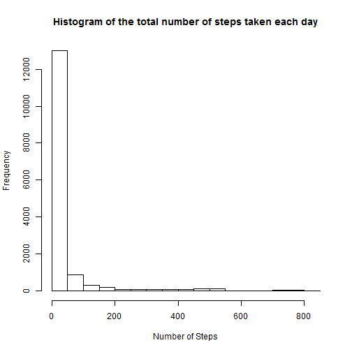
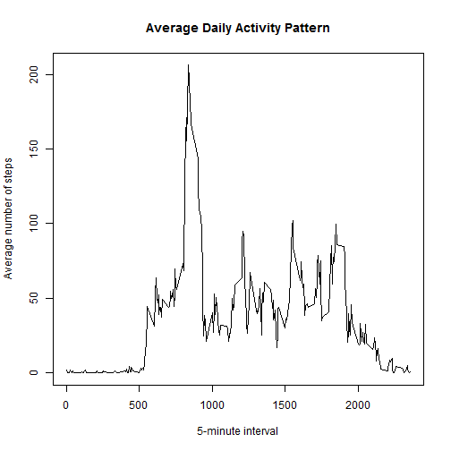
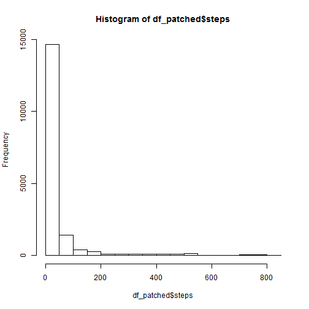
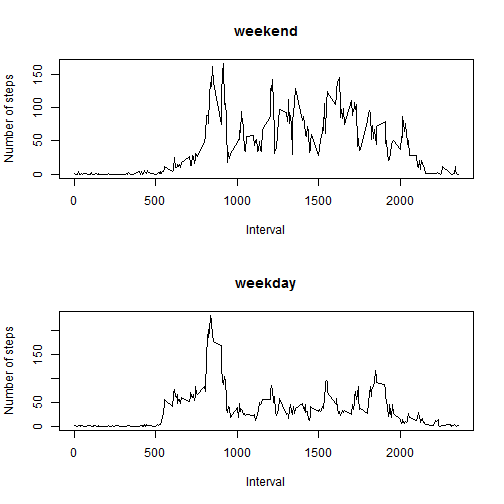

# Reproducible Research: Peer Assessment 1


## Loading and preprocessing the data

```r
unzip('activity.zip')
df$date <- as.POSIXct(as.character(df$date), format='%F')
```

## What is mean total number of steps taken per day?


```r
hist(df$steps, xlab='Number of Steps',
     main='Histogram of the total number of steps taken each day')
```

 

```r
total_by_date <- xtabs(steps ~ date, aggregate(steps ~ date, data=df, sum))
mean(total_by_date)
```

```
## [1] 10766
```

```r
median(total_by_date)
```

```
## 2012-11-12 
##      10765
```

## What is the average daily activity pattern?

```r
mean_by_interval <- aggregate(steps ~ interval, data=df, mean)
with(mean_by_interval, plot(interval, steps, type='l', xlab='5-minute interval',
     ylab='Average number of steps', main='Average Daily Activity Pattern'))
```

 

## Imputing missing values
The total number of rows with NAs is
__2304__ (calculated with the following
code):

```
nrow(df) - nrow(df[complete.cases(df),])
```


```r
names(mean_by_interval) <- c('interval', 'interval.mean')
df_patched <- merge(df, mean_by_interval)
df_patched$steps[is.na(df_patched$steps)] <- df_patched$interval.mean[is.na(df_patched$steps)]
df_patched$interval.mean <- NULL
hist(df_patched$steps)
```

 

```r
total_by_date_patched <- xtabs(steps ~ date, aggregate(steps ~ date, data=df_patched, sum))
mean(total_by_date_patched)
```

```
## [1] 10766
```

```r
median(total_by_date_patched)
```

```
## 2012-11-04 
##      10766
```

From the mean and median computed after the patching, it seems like
patching missing data with the mean by intervals does not affect the statistics
at all.

## Are there differences in activity patterns between weekdays and weekends?


```r
df_patched$day[grepl('^S', weekdays(df_patched$date))]  <- 'weekend'
df_patched$day[!grepl('^S', weekdays(df_patched$date))] <- 'weekday'

mean_by_interval_by_day <- aggregate(steps ~ interval + day, data=df_patched, mean)
par(mfrow=c(2,1))
with(mean_by_interval_by_day, {
  plot(interval[day=='weekend'], steps[day=='weekend'], type='l',
       xlab='Interval', ylab='Number of steps', main='weekend')
  plot(interval[day=='weekday'], steps[day=='weekday'], type='l',
       xlab='Interval', ylab='Number of steps', main='weekday')
})
```

 
